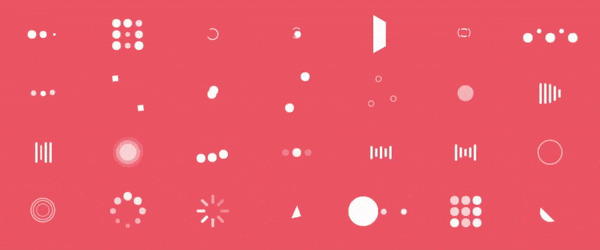

<h1 align="center">vue loaders</h1>

<div align="center">
  Based on <a href="https://github.com/ConnorAtherton/loaders.css">loaders.css</a>
</div>
<div align="center">
  
</div>

## NPM

```bash
$ npm install -S vue-loaders
```

## CDN

* umd: https://unpkg.com/vuex-up/dist/vue-loaders.umd.js
* esm/mjs: https://unpkg.com/vuex-up/dist/vue-loaders.esm.js
* umd: https://unpkg.com/vuex-up/dist/loaders/{ [loader name](#loaders-names) }.js

## Usage

If you prefer `<vue-loaders name="{loader name}">` syntax take look for available [names](#loaders-names). If you prefer `<vue-loaders-{loader name}>` syntax go to this [list](#components).

```javascript
import Vue from 'vue';
import 'vue-loaders/dist/vue-loaders.css';
import VueLoaders from 'vue-loaders';

Vue.use(VueLoaders);

const template = `
  <vue-loaders-ball-beat color="red" scale="2"></vue-loaders-ball-beat>
  <vue-loaders name="ball-beat" color="red" scale="2"></vue-loaders>
`;

new Vue({
  template
});
```

```javascript
import Vue from 'vue';
import 'vue-loaders/dist/vue-loaders.css';
import VueLoadersBallBeat from 'vue-loaders/dist/loaders/ball-beat.js';

Vue.use(VueLoadersBallBeat);

const template = `
  <vue-loaders-ball-beat color="red" scale="3"></vue-loaders-ball-beat>
`;

new Vue({
  template
});
```

```javascript
import Vue from 'vue';
import 'vue-loaders/dist/vue-loaders.css';
import VueLoaders from 'vue-loaders';

Vue.component('my-name', VueLoaders.component);
```

```javascript
import Vue from 'vue';
import 'vue-loaders/dist/vue-loaders.css';
import VueLoadersBallBeat from 'vue-loaders/dist/loaders/ball-beat.js';

Vue.component('my-name', VueLoadersBallBeat.component);
```

```javascript
import Vue from 'vue';
import 'vue-loaders/dist/vue-loaders.css';
import VueLoadersBallBeat from 'vue-loaders/dist/loaders/ball-beat.js';

Vue.use(VueLoadersBallBeat);

const template = `
  <vue-loaders-ball-beat color="red" scale="3"></vue-loaders-ball-beat>
`;

new Vue({ 
  components: {
    [VueLoadersBallBeat.component.name]: VueLoadersBallBeat.component
  },
  template
});
```

```HTML
<!DOCTYPE html>
<html>
  <head>
    <title>VueLoaders demo</title>
    <script src="https://unpkg.com/vue"></script>
    <link rel="stylesheet" href="https://unpkg.com/vue-loaders/dist/vue-loaders.css">
    <script src="https://unpkg.com/vue-loaders"></script>
  </head>
  <body>
    <div id="app">
      <vue-loaders-ball-beat color="red" scale="2"></vue-loaders-ball-beat>
      <vue-loaders name="ball-beat" color="red" scale="2"></vue-loaders>
    </div>
    <script>
      Vue.use(VueLoaders);
      new Vue().$mount('#app');
    </script>
  </body>
</html>
```

## Loaders names

```
ball-beat
ball-clip-rotate-multiple
ball-clip-rotate-pulse
ball-clip-rotate
ball-grid-beat
ball-grid-pulse
ball-pulse-rise
ball-pulse-sync
ball-pulse
ball-rotate
ball-scale-multiple
ball-scale-ripple-multiple
ball-scale-ripple
ball-scale
ball-spin-fade-loader
ball-triangle-path
ball-zig-zag-deflect
ball-zig-zag
cube-transition
line-scale-party
line-scale-pulse-out-rapid
line-scale-pulse-out
line-scale
line-spin-fade-loader
pacman
semi-circle-spin
square-spin
```

## Components

```
vue-loaders-ball-beat
vue-loaders-ball-clip-rotate-multiple
vue-loaders-ball-clip-rotate-pulse
vue-loaders-ball-clip-rotate
vue-loaders-ball-grid-beat
vue-loaders-ball-grid-pulse
vue-loaders-ball-pulse-rise
vue-loaders-ball-pulse-sync
vue-loaders-ball-pulse
vue-loaders-ball-rotate
vue-loaders-ball-scale-multiple
vue-loaders-ball-scale-ripple-multiple
vue-loaders-ball-scale-ripple
vue-loaders-ball-scale
vue-loaders-ball-spin-fade-loader
vue-loaders-ball-triangle-path
vue-loaders-ball-zig-zag-deflect
vue-loaders-ball-zig-zag
vue-loaders-cube-transition
vue-loaders-line-scale-party
vue-loaders-line-scale-pulse-out-rapid
vue-loaders-line-scale-pulse-out
vue-loaders-line-scale
vue-loaders-line-spin-fade-loader
vue-loaders-pacman
vue-loaders-semi-circle-spin
vue-loaders-square-spin
vue-loaders-triangle-skew-spin
```

## Props

`vue-loaders` component have following props:

 * `name` - name of loader(see [names](#loaders-names)).
 * `color` - loader color. May be any [css color value](https://developer.mozilla.org/en-US/docs/Web/CSS/color_value).
 * `scale` - loader scale. May be any [scale number](https://developer.mozilla.org/en-US/docs/Web/CSS/transform-function/scale)
 

`vue-loaders-{loader name}` component(see [components](#components)) have following props:

 * `color` - loader color. May be any [css color value](https://developer.mozilla.org/en-US/docs/Web/CSS/color_value).
 * `scale` - loader scale. May be any [scale number](https://developer.mozilla.org/en-US/docs/Web/CSS/transform-function/scale)
 
 Examples:
 
```html
<vue-loaders name="ball-beat" color="black" scale="1.2"></vue-loaders>
```

```html
<vue-loaders-ball-beat color="black" scale="1"></vue-loaders-ball-beat>
```
