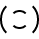
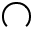
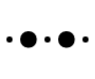
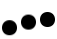
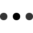
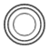
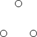
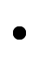
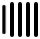

<div align="center">
    
</div>

<h1 align="center">vue loaders</h1>

<div align="center">
    <a href="https://www.npmjs.com/package/vue-loaders"></a>
</div>

<div align="center">
  <a href="https://github.com/ConnorAtherton/loaders.css">loaders.css</a> + vue
</div>

[< previous version](https://github.com/Hokid/vue-loaders/tree/34e07c7c88e602423e497427e9f322692bd336d4)

## NPM

```bash
$ npm install -S vue-loaders
```

## CDN

* umd: https://unpkg.com/vue-loaders/dist/vue-loaders.umd.js
* esm/mjs: https://unpkg.com/vue-loaders/dist/vue-loaders.esm.js
* umd: `https://unpkg.com/vue-loaders/dist/loaders/`[loader name](#loaders)`.js`

## Usage

Take a look at available [names](#loaders) if you prefer `<vue-loaders name="{loader name}">` syntax. 

Take a look at available [components list](#loaders) if you prefer `<vue-loaders-{loader name}>` syntax. 

For available props see [props](#props).

```javascript
import Vue from 'vue/dist/vue.esm.browser';
import 'vue-loaders/dist/vue-loaders.css';
import VueLoaders from 'vue-loaders';

Vue.use(VueLoaders);

const template = `
<div>
  <vue-loaders-ball-beat color="red" scale="1"></vue-loaders-ball-beat>
  <hr/>
  <vue-loaders name="ball-beat" color="red" scale="1"></vue-loaders>
</div>
`;

new Vue({
  template
}).$mount('#app');
```

```javascript
import Vue from 'vue/dist/vue.esm.browser';
import 'vue-loaders/dist/vue-loaders.css';
import VueLoadersBallBeat from 'vue-loaders/dist/loaders/ball-beat';

Vue.use(VueLoadersBallBeat);

const template = `
  <vue-loaders-ball-beat color="red" scale="1"></vue-loaders-ball-beat>
`;

new Vue({
  template
}).$mount('#app');
```

```javascript
import Vue from 'vue/dist/vue.esm.browser';
import 'vue-loaders/dist/vue-loaders.css';
import VueLoaders from 'vue-loaders';

Vue.component('my-name', VueLoaders.component);

const template = `
  <my-name name="ball-beat" color="red" scale="1"></my-name>
`;

new Vue({
  template
}).$mount('#app');
```

```javascript
import Vue from 'vue/dist/vue.esm.browser';
import 'vue-loaders/dist/vue-loaders.css';
import VueLoadersBallBeat from 'vue-loaders/dist/loaders/ball-beat';

Vue.component('my-name', VueLoadersBallBeat.component);

const template = `
  <my-name color="red" scale="1"></my-name>
`;

new Vue({
  template
}).$mount('#app');
```

```javascript
import Vue from 'vue/dist/vue.esm.browser';
import 'vue-loaders/dist/vue-loaders.css';
import VueLoadersBallBeat from 'vue-loaders/dist/loaders/ball-beat.js';

const template = `
  <vue-loaders-ball-beat color="red" scale="1"></vue-loaders-ball-beat>
`;

new Vue({
  components: {
    [VueLoadersBallBeat.component.name]: VueLoadersBallBeat.component
  },
  template
}).$mount('#app');
```

If you want setting a loader color in your styles, see example below:
```javascript
import Vue from 'vue/dist/vue.esm.browser';
import 'vue-loaders/dist/vue-loaders.css';
import VueLoaders from 'vue-loaders';

Vue.use(VueLoaders);

const template = `
<div style="color: red;">
  <vue-loaders-ball-beat color="currentColor" scale="1"></vue-loaders-ball-beat>
</div>
`;

new Vue({
  template
}).$mount('#app');
```
[live example](https://codepen.io/Hokid/pen/xoaZew)

```HTML
<!DOCTYPE html>
<html>
  <head>
    <title>VueLoaders demo</title>
    <script src="https://unpkg.com/vue"></script>
    <link rel="stylesheet" href="https://unpkg.com/vue-loaders/dist/vue-loaders.css">
    <script src="https://unpkg.com/vue-loaders"></script>
  </head>
  <body>
    <div id="app">
      <vue-loaders-ball-beat color="red" scale="2"></vue-loaders-ball-beat>
      <hr/>
      <vue-loaders name="ball-beat" color="red" scale="2"></vue-loaders>
    </div>
    <script>
      Vue.use(VueLoaders);
      new Vue().$mount('#app');
    </script>
  </body>
</html>
```

## Loaders

|Preview|Name|Component|
:-:|-|-|
||ball-beat|`<vue-loaders-ball-beat/>`|
||ball-clip-rotate-multiple|`<vue-loaders-ball-clip-rotate-multiple/>`|
||ball-clip-rotate-pulse|`<vue-loaders-ball-clip-rotate-pulse/>`|
||ball-clip-rotate|`<vue-loaders-ball-clip-rotate/>`|
||ball-grid-beat|`<vue-loaders-ball-grid-beat/>`|
||ball-grid-pulse|`<vue-loaders-ball-grid-pulse/>`|
||ball-pulse-rise|`<vue-loaders-ball-pulse-rise/>`|
||ball-pulse-sync|`<vue-loaders-ball-pulse-sync/>`|
||ball-pulse|`<vue-loaders-ball-pulse/>`|
||ball-rotate|`<vue-loaders-ball-rotate/>`|
||ball-scale-multiple|`<vue-loaders-ball-scale-multiple/>`|
||ball-scale-ripple-multiple|`<vue-loaders-ball-scale-ripple-multiple/>`|
||ball-scale-ripple|`<vue-loaders-ball-scale-ripple/>`|
||ball-scale|`<vue-loaders-ball-scale/>`|
||ball-spin-fade-loader|`<vue-loaders-ball-spin-fade-loader/>`|
||ball-triangle-path|`<vue-loaders-ball-triangle-path/>`|
||ball-zig-zag-deflect|`<vue-loaders-ball-zig-zag-deflect/>`|
||ball-zig-zag|`<vue-loaders-ball-zig-zag/>`|
||cube-transition|`<vue-loaders-cube-transition/>`|
||line-scale-party|`<vue-loaders-line-scale-party/>`|
||line-scale-pulse-out-rapid|`<vue-loaders-line-scale-pulse-out-rapid/>`|
||line-scale-pulse-out|`<vue-loaders-line-scale-pulse-out/>`|
||line-scale|`<vue-loaders-line-scale/>`|
||line-spin-fade-loader|`<vue-loaders-line-spin-fade-loader/>`|
||pacman|`<vue-loaders-pacman/>`|
||semi-circle-spin|`<vue-loaders-semi-circle-spin/>`|
||square-spin|`<vue-loaders-square-spin/>`|
||triangle-skew-spin|`<vue-loaders-triangle-skew-spin/>`|

## Props

`vue-loaders` component support the following props:

 * `name` - name of loader(see [names](#loaders)).
 * `color` - loader color. May be any [css color value](https://developer.mozilla.org/en-US/docs/Web/CSS/color_value).
 * `scale` - loader scale. May be any [scale number](https://developer.mozilla.org/en-US/docs/Web/CSS/transform-function/scale)
 

`vue-loaders-{loader name}` components(see [components](#loaders)) support the following props:

 * `color` - loader color. May be any [css color value](https://developer.mozilla.org/en-US/docs/Web/CSS/color_value).
 * `scale` - loader scale. May be any [scale number](https://developer.mozilla.org/en-US/docs/Web/CSS/transform-function/scale)
 
 Examples:
 
```html
<vue-loaders name="ball-beat" color="black" scale="1.2"></vue-loaders>
```

```html
<vue-loaders-ball-beat color="black" scale="1"></vue-loaders-ball-beat>
```
